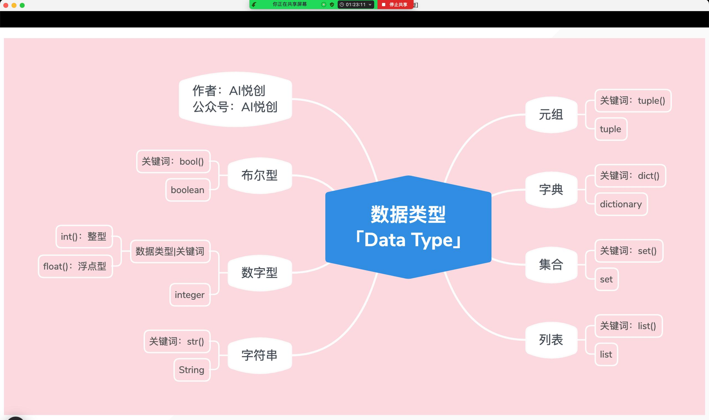

## Data Types

### 1. Detection of Data Types

```python
int_num =1
t = type(int_num)
print(int_num)
print("Its type is:", t)
print("Detect the data type and output it:", type(int_num))
```

### 2. Numbers `int` and   `float`

1.  `int`

```python
int_num =1
t = type(int_num)
print(int_num)
print("Its type is:", t)
print("Detect the data type and output it:", type(int_num))

#output
```

2. `float`

```python
float_num = 1.5
t = type(float_num)
print(float_num)
print("Its type is:", t)
print("Detect the data type and output it:", type(float_num))

#output
1.5
Its type is: <class 'float'>
    Detect the data type and output it: <class 'float'>
```

### 3. String

```python
string = "Hello"
t = type(string)
print(string)
print("String type is:", t)
print ("Detect the data type and output it :", type(string))

#output
Hello
String type is: <class 'str'>
Detect the data type and output it : <class 'str'>
```

##### The 3 Characteristics of String

1. They are indexed:

    Every Character in a String has an index and can be found. That means it is in one or another way individual.

2. Strings are not allowed to be altered

    In the run code the String stays the way it was defined and cannot be altered in any way.

3. Any character can become part of a string 

    Whatever character there is, it can be a string  `string= £$&j2`

### 4. Lists

```python
lst = ["Hello World", 3 , 5.6, ("well", "well", "well", 70), [13, "Penzberg"], True, False]
t = type(lst)
print(lst)
print("lst type is:",t)
print("Detect data type and output:", type(lst))

#output
['Hello World', 3, 5.6, ('well', 'well', 'well', 70), [13, 'Penzberg'], True, False]
lst type is: <class 'list'>
Detect data type and output: <class 'list'>
```

##### The characteristics of Lists

- Indexed
    - unlike Strings, Lists Items are indexed and not the characters
- Can be altered 
    - unlike Strings, the items in Lists can be altered
- Can only have Python pre-defined Data Types





### 5.Dictionary

- key :
    - can be `int`
    - can be string 
    - cannot be list
    - cannot be dictionary
    - is not mutable

```python
d = {3:"asdf","hello ":True, False: 1}
```

- value
    - anything can be the value
    - ANYTHING

- orders
    - unordered until python 3.6
    - ordered from that point on 

### 6.Set

1. Sets are unindexed

```python
set1=[1,2,3,"Hello",(1,2,5),True,6,8]
set2=[1,2,3,"Hello",(1,2,5),True,6,8]
print(set1)
print(set2)
```

```python
#outcome is random
```

How can we prove that sets are unindexed?

- We simply add item into the set and watch that the return of the print functions are always different 
- But there is a problem: 
    - Python is bugged
    - It will often give you the same result anyway because it just saves on of the results and returns the same thing

- The question is why?
    - After version Python version 3.6 it is like hash 

2. Sets can only have certain values
    - that means lists are not allowed

### 7.Condition

1. ONLY ,`TRUE` ,`FALSE`
2. True is equal to 1, False is equal to 0
3. All empty lists are False and none empty list are True 