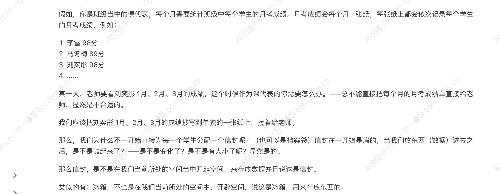

# Variable  （变量）

## 1.  Understanding variables- real-life-examples

### 1.1 Understand the literal meaning 

- 变 :Change
- 量 : Size

### 1.2 Example



- That means, variables are just spaces created in the computer's memory to store data.

### 1.3 The Characteristics of Variables

Characteristics : The value of the variable will be overwritten, only the last value will be remembered


## 2. How to create Variables - assign statements

1.  Variable: represents or references a value through a variable name

    -  A girl created a clay figure, but the clay figure had no life. The girl waved her wand and gave the clay figure life.  At this point, the clay figure can be considered a descendent of the girl. [Variable: Clay figure, Value(expression): the girl] ` Clay figure = girl`

2.  Initialization assignment statement:  Variable name = expression [ `= ` is called the assignment operator]

    a. Variable name:  This is what we call it 

    b. Expression: similar to mathematical expression

3.  Series of the running code:  **up to down** , **right to left** (meaning it's calculating the entire right before assigning it to the variable)

4.  Writing the code 

```python
x = 1 # 1 is assigned to x, meaning that x represents 1
x = x +10 # x is equivalent to 1, it is added to 10, at last we get our solution of 11
print(x) # output of x 
```

``` python
name1= "bob"
name2= name1
print(name2)
```

```python
name1="thatName"
name1="otherName"
print(name1)
```

## 3. Explore the function `print` 

### 3.1 Output multiple values at the same time 

```python
a = 1
b = 2
c = 3
print(a,b,c )
```

``` python
1 2 3 
```

When using `,` the comma between values, in the output python adds spaces between the values

### 3.2 . `sep` modifies the separators between the values

```python
a = 1
b = 2
c = 3
print(a,b,c, sep = " space ")
```

```python
1 space 2 space 3
```

```python
a = 1
b = 2
c = 3
print(a,b,c, sep = "")
```

```
123
```

### 3.3 `end` modifies the print output endling method 

```python
a = 1
b = 2
c = 3
print(a)
print(b)
print(c)
```

```
1
2
3
```

```python
a = 1
b = 2
c = 3
print(a, end = " lllll ")
print(b)
print(c)
```

```
1 lllll 2
3
```

### 3.4 With `end` and `sep`

```python
a=1
b=2
c=3
print (a, sep="hhhh")
print(a,b,c, sep="~", end = "love Python")
print(c)
```

```
1
1~2~3 lovePython3
```

### 3.5 Outputting multiple Values with print 

```python
#You can add prompts when outputting, which is based on print being able to output multiple variables at the same time

a = 1
print("the value of a is:", a)
```

```
the value of a is: 1
```

## 4. Advanced assignment methods

Previously, when wanting to assign the same value to multiple variables we could only do the following: 

```python
a = 1
b = 1
c = 1
print(a,b,c)
```

```1
1 1 1
```

Now there are easier ways to do this is Python 

```python
a = b = c =1
print (a,b,c)
```

```
1 1 1
```

