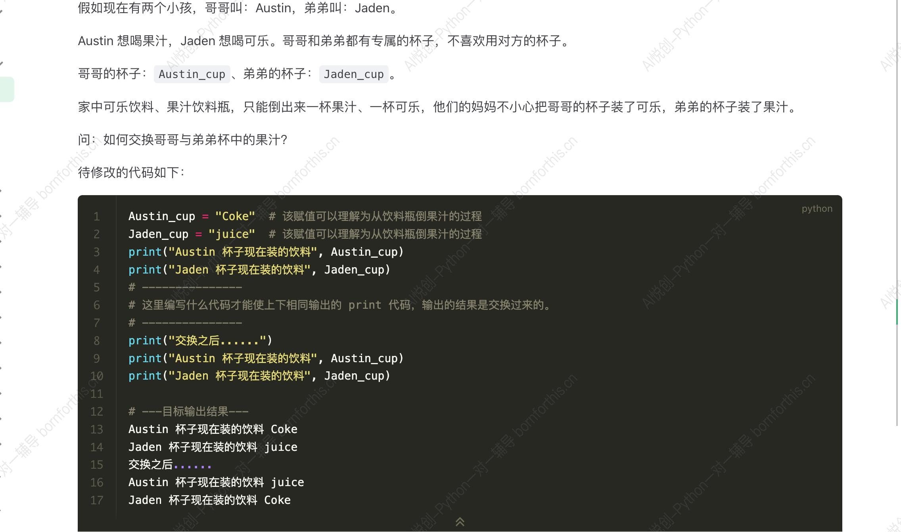

# Variable  （变量）

## 1.  Understanding variables- real-life-examples

### 1.1 Understand the literal meaning 

- 变 :Change
- 量 : Size

### 1.2 Example


- That means, variables are just spaces created in the computer's memory to store data.

### 1.3 The Characteristics of Variables

Characteristics : The value of the variable will be overwritten, only the last value will be remembered


## 2. How to create Variables - assign statements

1.  Variable: represents or references a value through a variable name

    -  A girl created a clay figure, but the clay figure had no life. The girl waved her wand and gave the clay figure life.  At this point, the clay figure can be considered a descendent of the girl. [Variable: Clay figure, Value(expression): the girl] ` Clay figure = girl`

2.  Initialization assignment statement:  Variable name = expression [ `= ` is called the assignment operator]

    a. Variable name:  This is what we call it 

    b. Expression: similar to mathematical expression

3.  Series of the running code:  **up to down** , **right to left** (meaning it's calculating the entire right before assigning it to the variable)

4.  Writing the code 

```python
x = 1 # 1 is assigned to x, meaning that x represents 1
x = x +10 # x is equivalent to 1, it is added to 10, at last we get our solution of 11
print(x) # output of x 
```

``` python
name1= "bob"
name2= name1
print(name2)
```

```python
name1="thatName"
name1="otherName"
print(name1)
```

## 3. Explore the function `print` 

### 3.1 Output multiple values at the same time 

```python
a = 1
b = 2
c = 3
print(a,b,c )
```

``` python
1 2 3 
```

When using `,` the comma between values, in the output python adds spaces between the values

### 3.2 . `sep` modifies the separators between the values

```python
a = 1
b = 2
c = 3
print(a,b,c, sep = " space ")
```

```python
1 space 2 space 3
```

```python
a = 1
b = 2
c = 3
print(a,b,c, sep = "")
```

```
123
```

### 3.3 `end` modifies the print output endling method 

```python
a = 1
b = 2
c = 3
print(a)
print(b)
print(c)
```

```
1
2
3
```

```python
a = 1
b = 2
c = 3
print(a, end = " lllll ")
print(b)
print(c)
```

```
1 lllll 2
3
```

### 3.4 With `end` and `sep`

```python
a=1
b=2
c=3
print (a, sep="hhhh")
print(a,b,c, sep="~", end = "love Python")
print(c)
```

```
1
1~2~3 lovePython3
```

### 3.5 Outputting multiple Values with print 

```python
#You can add prompts when outputting, which is based on print being able to output multiple variables at the same time

a = 1
print("the value of a is:", a)
```

```
the value of a is: 1
```

## 4. Advanced assignment methods

Previously, when wanting to assign the same value to multiple variables we could only do the following: 

```python
a = 1
b = 1
c = 1
print(a,b,c)
```

```1
1 1 1
```

Now there are easier ways to do this is Python 

```python
a = b = c =1
print (a,b,c)
```

```
1 1 1
```

### 4.2 Multiple Variable definition at once

```python
a,b,c = 1,2,3
print(a,b,c)


#output:
1 2 3
```




Solutions:

```python
Austin_cup = "Coke"  # 该赋值可以理解为从饮料瓶倒果汁的过程
Jaden_cup = "juice"  # 该赋值可以理解为从饮料瓶倒果汁的过程
print("Austin 杯子现在装的饮料", Austin_cup)
print("Jaden 杯子现在装的饮料", Jaden_cup)
# ---------------
# 这里编写什么代码才能使上下相同输出的 print 代码，输出的结果是交换过来的。
# ---------------
Cup3 = Austin_cup
Austin_cup = Jaden_cup
Jaden_cup = Cup3

print("交换之后......")
print("Austin 杯子现在装的饮料", Austin_cup)
print("Jaden 杯子现在装的饮料", Jaden_cup)

# ---目标输出结果---

```

```python
Austin_cup = "Coke"  # 该赋值可以理解为从饮料瓶倒果汁的过程
Jaden_cup = "juice"  # 该赋值可以理解为从饮料瓶倒果汁的过程
print("Austin 杯子现在装的饮料", Austin_cup)
print("Jaden 杯子现在装的饮料", Jaden_cup)
# ---------------
# 这里编写什么代码才能使上下相同输出的 print 代码，输出的结果是交换过来的。
# ---------------
Austin_cup, Jaden_cup = Jaden_cup, Austin_cup

print("交换之后......")
print("Austin 杯子现在装的饮料", Austin_cup)
print("Jaden 杯子现在装的饮料", Jaden_cup)

# ---目标输出结果---

```

The question comes on why the second option also works

It solely relies on the fact of how python runs its codes.

It is up to down, right to left. 

That means that first the values are calculated and in the last step they are pasted to the variables. 

## 5.  Variable naming rules 

1. Variable names are a combination of uppercase latin letters and numbers, while they are not allowed to start with a number
2. System keywords are not allowed 
3. Variable names ARE case sensitive
4. Variables cannot contain spaces but they can contain underscores
5. Pythons built in Python function names cannot be used

```python
n = 1
N = 2
print(n)

#output
1
```

```python
1name = "bob"
name1 = "bob"

# you are not able to start a variable with a digit as Python thinks it is an integer
```

```python
user_name = "hello"
username ="hello"
_username = "hello"

# you are allowed to use the underscore whereever you want in the variable name 
#its usage is to make ones code clearer
```

```python
print = 123
print(print)

# you are simply not able to do this or at least it is not recommended as python cannot differentiate the
# that means you are able to use one of these operators if you do not use them in the way you are supposed to 
```

```python
as = "hello" # this is not possible 

#possible solutions
As = "Hello"
aS ="Hello"
AS = "Hello"
_as = "Hello"

# it is forbidden to use these built in function names as variable names 
# Though its name is then not the same anymore you can alter the cases or alternatively add an underscore
```

