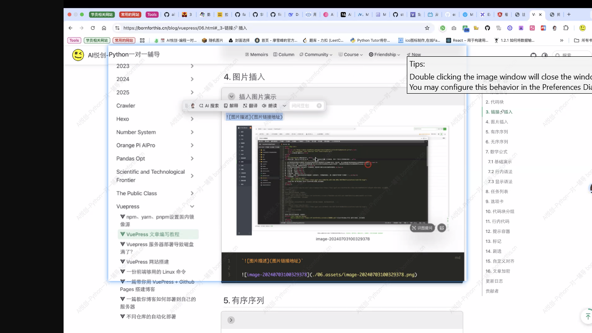

## 1. Titles

::: md-demo 演示

# Title1

## Title2

### Title3

#### Title4

##### Title5

###### Title6


> While writing an article Heading 1 in rarely used as it is then seen as the actual title

:::

## 2.Code Block

::: md-demo Code Block Adding Syntax Demo


1. markdown 语法

``` markdown
# 标题1
## 标题2
### 标题3 
#### 标题4
##### 标题5
###### 标题6
```

2. python 代码

   ``` python
   import random
   
   number_to_guess = random.randint(1, 100)
   guess_count = 0
   max_tries = 10
   
   print("猜数字游戏开始！尝试猜测一个在 1 到 100 之间的数字。你有 10 次机会。")
   
   while guess_count < max_tries:
       guess_str = input("请输入你的猜测：")
       if not guess_str.isdigit():
           print("请输入一个有效数字！")
           continue
       guess = int(guess_str)
       guess_count += 1
   
       if guess < number_to_guess:
           print("太低了！再试一次。")
       elif guess > number_to_guess:
           print("太高了！再试一次。")
       else:
           print(f"恭喜！你猜对了数字 {number_to_guess}！你总共猜了 {guess_count} 次。")
           break
   if guess != number_to_guess:
       print(f"很遗憾，你的机会已用完。正确的数字是 {number_to_guess}。")
   
   ```

3. java 代码

   ``` java
   public class HelloWorld {
       public static void main(String[] args) {
           // 输出 Hello Bornforthis 到控制台
           System.out.println("Hello, Bornforthis!");
       }
   }
   
   ```

   

:::

## 3. links

::: md-demo 链接

`[link name ](link)`

[link](https://bigsnowman10.github.io)

:::

## 4.picture 

::: md-demo

`![picture ]（adress of picture link）`




:::

## 5.ordered sequence

::: md-demo

1. me

2. you

3. him
    1. wow1
    2. wow2
    3. wow3
4. little man 

:::

##  6.disordered sequence

::: md-demo

- Birkenstrasse 
    - wegen
    - folgendem
- Bahnhofstrasse
    - meh

:::

## 7. Mathematical Formulas 

::: md-demo

### 7.1基础演示

Using the \$ at the front and back we can make it a mathematical term

$$
x a b
$$

$$
33f
$$


### 7.2 行内语法

Euler's identity $e^{i\pi}+1=0$ is a beautiful formula in $\mathbb{R}^2$.


### 7.3 显示语法

$$
\frac {\partial^r} {\partial \omega^r} \left(\frac {y^{\omega}} {\omega}\right)
= \left(\frac {y^{\omega}} {\omega}\right) \left\{(\log y)^r + \sum_{i=1}^r \frac {(-1)^i r \cdots (r-i+1) (\log y)^{r-i}} {\omega^i} \right\}
$$

:::

- [TeX 教程](https://www.overleaf.com/learn/latex/Learn_LaTeX_in_30_minutes)

- [Tex 速查表](https://mdit-plugins.github.io/zh/tex.html#tex-tutorial)


## 8. 任务列表

::: md-demo

- [ ] 
- [x] 

`- [x] `

:::

## 9.Tabs

:::: md-demo

::: tabs 

@tab Tab1

There will be things in here

hello there 

@tab Tab2

Heute gibts Freibier 

1. B
2. c
3. f

@tab TabWithA

:::


$$
b+2
$$


::::

## 10.Seperating Codes

:::: md-demo

::: code-tabs

@tab Code1

```python
print("This is Code1")
```

@tab Code2

```python
a=1
b=2
b=a+b
```


:::


::: code-tabs

@tab Python

```python
a, b, c = 1, 2, 3
```

@pnpm

```pnpm 
pnpm add -D 组件名称
```


::::


## 11.Code in a line

::: md-demo

pnpm install xxxx

`pnpm install xxxx`

:::

## 12.reminder container

:::: md-demo

::: important

important things

:::

::: info 

Information

:::

::: note

What is this？

::: 

:::  tip

tips, halt

:::

::: warning

ACHTUNG

:::

::: caution

nasser Boden

:::

::: details

Ja das wichtig 

:::


::::

## 13.Signs

::: md-demo

Hello，==William==。

Hello，!!William!!

:::


## 14.Custom Alignment

:::: md-demo

::: left

on the left

:::

::: center

in the middle

:::

::: right

on the right 

:::

::: justify

nothing

:::

::::


:::: caution

If ANYTHING happens 

::: center 

don't panic

:::

::::

## 15.Article encryption

file: `theme.ts`

```typescript
encrypt: {
    config: {
        // This encrypts the entire guide directory and both passwords are available
        "/guide/": ["1234", "5678"],
        // this will only encript /config/page.html
        "/config/page.html": ["1234", "1234343"],
    }
}
```


